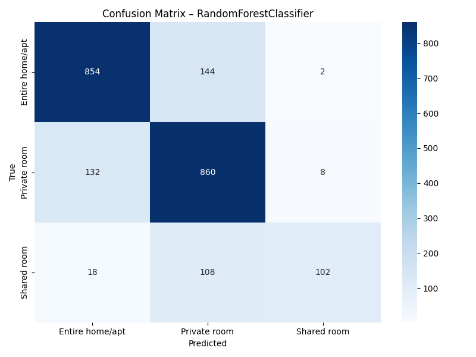

# Projeto 2 – Classificação do tipo de quarto (Airbnb NYC 2019)

Este projeto dá continuidade à análise do **Projeto 1** da disciplina de
Introdução à Ciência de Dados. Utilizando o mesmo conjunto de dados do Airbnb
de Nova Iorque (`AB_NYC_2019.csv`), o objetivo agora é **prever o tipo de
quarto** anunciado (``room_type``) a partir de variáveis numéricas e
categóricas do anúncio. O trabalho segue os passos descritos no
PDF do Projeto 2 e implementa **pré‑processamento**, divisão em
treinamento/validação/teste, seleção de hiper‑parâmetros com rastreamento
via MLFlow (neste caso, um _stub_ de MLFlow) e diagnóstico do melhor modelo.

## Etapas principais

1. **Escolha da variável alvo**: foi selecionada a coluna **``room_type``** do
   dataset, que possui três categorias principais (``Entire home/apt``,
   ``Private room`` e ``Shared room``). A tarefa é, portanto,
   **multiclasse**.
2. **Pré‑processamento e limpeza**:
   - Conversão da coluna `last_review` para data e criação da variável
     ``days_since_last_review`` (dias desde a última avaliação).
   - Substituição de valores ausentes em `reviews_per_month` e
     `days_since_last_review` por 0.
   - Remoção de outliers extremos na coluna `price` pelo método do IQR.
   - Exclusão de colunas irrelevantes para a previsão (`id`, `name`,
     `host_id`, `host_name`, `last_review`).
   - Amostragem estratificada de **15 000 registros** (caso o
     conjunto ultrapasse esse tamanho) para reduzir o tempo de treinamento.
3. **Divisão dos dados**: o conjunto amostrado foi dividido em
   60 % para **treinamento**, 20 % para **validação** e 20 % para
   **teste**, utilizando estratificação para preservar a distribuição das
   classes.
4. **Modelos avaliados**: quatro algoritmos de classificação foram testados
   com um pequeno grid de hiper‑parâmetros:
   - **Regressão Logística** (baseline – sem busca de hiperparâmetros);
   - **Random Forest Classifier** (profundidade indefinida ou 20);
   - **SVC** com kernels ``rbf`` e ``linear``;
   - **K‑Nearest Neighbors** variando o número de vizinhos.
5. **Rastreamento de experimentos**: devido à ausência do pacote MLFlow no
   ambiente, foi implementado um módulo `mlflow_stub` que registra os
   hiper‑parâmetros e métricas em arquivos JSON dentro da pasta `mlruns/`.
6. **Seleção de hiper‑parâmetros**: para cada algoritmo foi avaliada uma
   pequena combinação de hiper‑parâmetros no conjunto de validação. O
   melhor modelo de cada família foi identificado com base na **acurácia**.
7. **Escolha do melhor modelo geral**: após avaliar os modelos no
   conjunto de teste, escolheu‑se o que obteve maior acurácia. Em seguida,
   foram gerados o relatório de classificação e a matriz de confusão para
   análise dos erros.

## Resultados resumidos

Os valores de acurácia obtidos na validação e no teste estão na tabela a seguir
(maiores valores em negrito). Observe que o melhor desempenho foi alcançado
pelo **Random Forest Classifier**.

| Algoritmo                | Acurácia (validação) | Acurácia (teste) |
|-------------------------|----------------------|------------------|
| Regressão Logística     | 0,7504               | 0,7675           |
| **Random Forest**       | **0,7873**           | **0,8151**       |
| SVC                     | 0,7801               | 0,7998           |
| KNN                     | 0,7226               | 0,7527           |

O melhor modelo (Random Forest) alcançou aproximadamente **81,5 % de acurácia**
no conjunto de teste. Abaixo está a matriz de confusão, gerada a partir do
conjunto de teste, que permite identificar quais classes são mais
confundidas:



O relatório de classificação completo, incluindo precisão, recall e F1‑score
para cada classe, encontra‑se no arquivo
`results/best_model_classification_report.txt`. Em resumo, o modelo possui
boa precisão para anúncios de tipo “Entire home/apt” e “Private room”. Para
“Shared room” a performance é inferior devido ao desequilíbrio de classes.

## Como reproduzir

1. Certifique‑se de que as bibliotecas `pandas`, `numpy`, `scikit‑learn`,
   `matplotlib` e `seaborn` estejam instaladas.
2. Coloque o arquivo `AB_NYC_2019.csv` (utilizado no Projeto 1) na raiz do
   projeto.
3. Execute o script:

   ```bash
   cd project2
   python analysis.py
   ```

Os resultados serão salvos em `project2/results/` e as figuras em
`project2/figures/`. Os registros de experimentos ficam em `mlruns/`.

## Conclusões

O estudo demonstra que é possível prever o tipo de acomodação com um nível de
acurácia razoável a partir de características básicas do anúncio. O modelo
Random Forest mostrou‑se mais robusto, provavelmente devido à capacidade de
capturar relações não‑lineares entre as variáveis. Para melhorias futuras,
poderiam ser testados modelos mais sofisticados (como **XGBoost**) e
estratégias de balanceamento de classes. Além disso, técnicas de
**clustering** poderiam ser empregadas para segmentar regiões e entender
melhor a dinâmica dos preços antes da modelagem.
